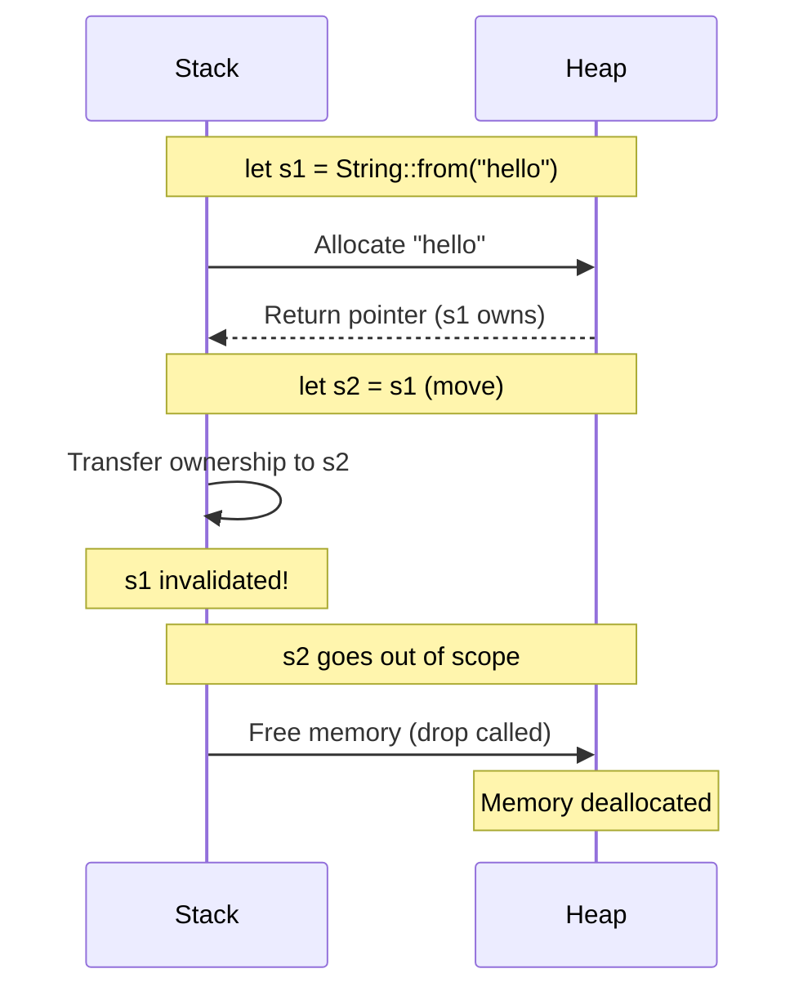
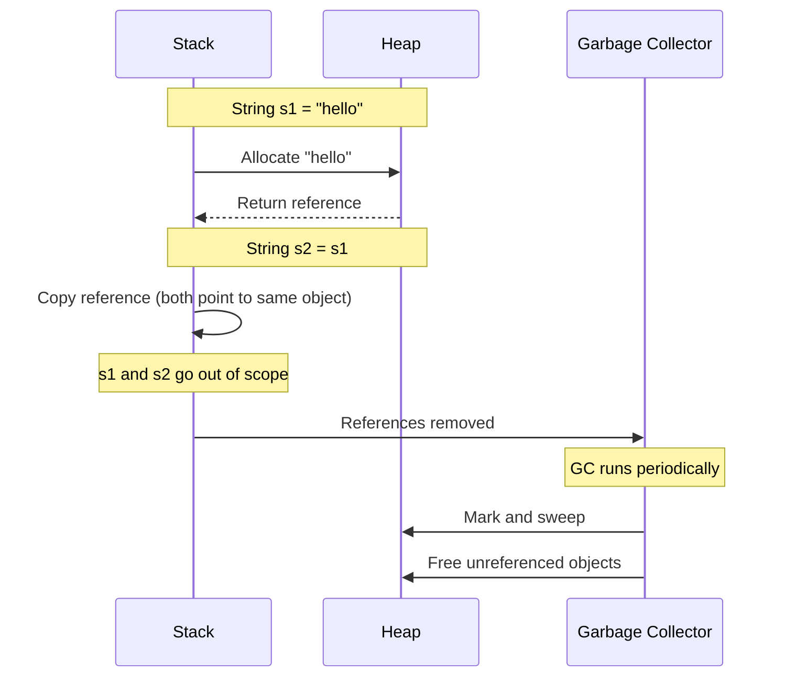
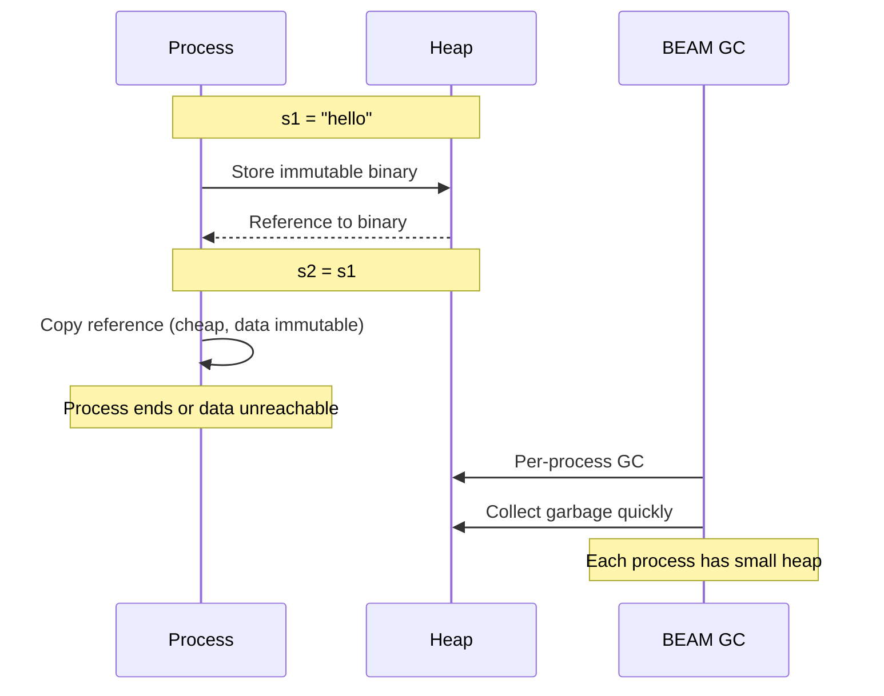
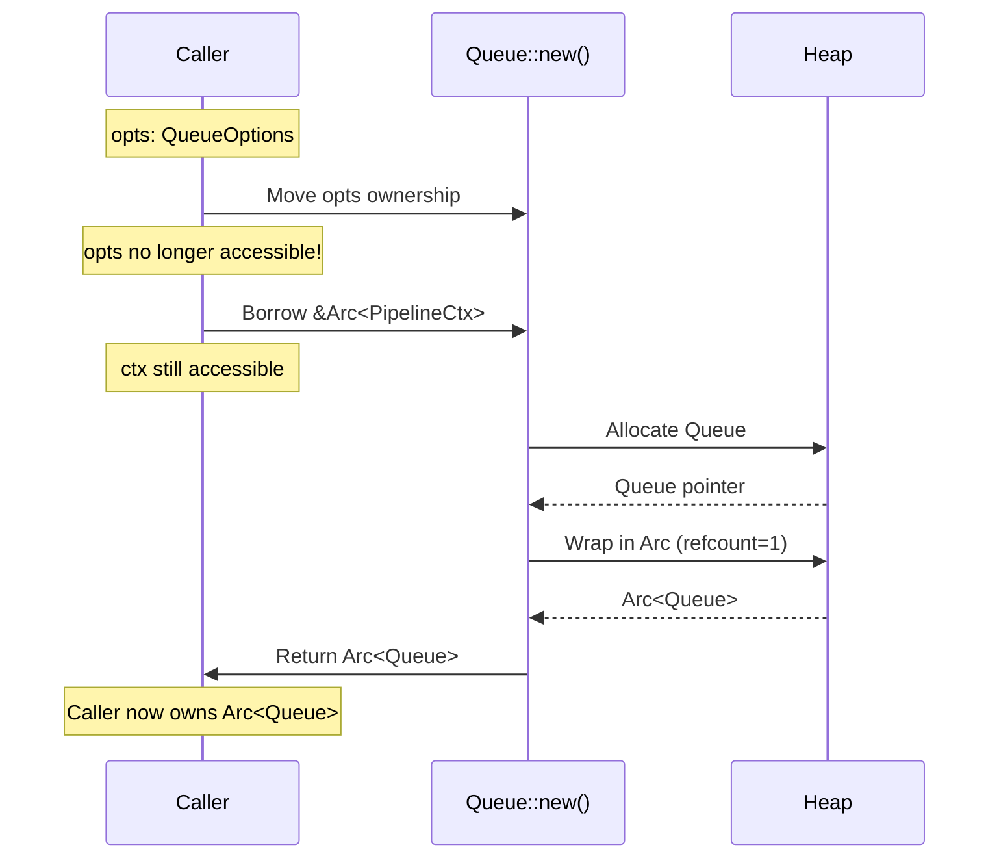

# Ownership & Memory Management

A side-by-side comparison across languages

## Concept Overview

**Rust's ownership system** ensures memory safety without garbage collection. Every value has exactly one owner, and the memory is freed when the owner goes out of scope.

---

## Side-by-Side Comparison

### Rust

```rust
fn main() {
    let s1 = String::from("hello");  // s1 owns the string
    let s2 = s1;                     // Ownership moved to s2
    // println!("{}", s1);            // ERROR: s1 no longer valid!
    println!("{}", s2);              // OK: s2 owns the string
}

// With borrowing (no ownership transfer)
fn main() {
    let s1 = String::from("hello");
    let s2 = &s1;                    // s2 borrows s1
    println!("{}", s1);              // OK: s1 still owns
    println!("{}", s2);              // OK: s2 borrowed
}
```

### Java

```java
public class Main {
    public static void main(String[] args) {
        String s1 = "hello";         // s1 references the string
        String s2 = s1;              // s2 also references same string
        System.out.println(s1);      // OK: both valid
        System.out.println(s2);      // OK: garbage collector manages memory
    }
}
// GC decides when to free memory
```

### Python

```python
def main():
    s1 = "hello"                     # s1 references the string
    s2 = s1                          # s2 also references same object
    print(s1)                        # OK: both valid
    print(s2)                        # OK: reference counting + GC

# Memory freed when refcount reaches 0
```

### TypeScript

```typescript
function main() {
    let s1 = "hello";                // s1 references the string
    let s2 = s1;                     // s2 also references same value
    console.log(s1);                 // OK: both valid
    console.log(s2);                 // OK: JS engine's GC manages memory
}
```

### Elixir

```elixir
defmodule Main do
  def main do
    s1 = "hello"                     # s1 binds to string (immutable)
    s2 = s1                          # s2 binds to same value
    IO.puts(s1)                      # OK: immutable data is safe to share
    IO.puts(s2)                      # OK: BEAM VM manages memory
  end
end
```

---

## Runtime Behavior: Memory Management

### Rust - Ownership Transfer



### Java - Garbage Collection



### Elixir - Immutable Data



---

## Ownership in Smelter Codebase

From `smelter-core/src/queue.rs:164`:

```rust
pub(crate) fn new(opts: QueueOptions, ctx: &Arc<PipelineCtx>) -> Arc<Self> {
    // opts: Owned (moved into function)
    // ctx: Borrowed (shared reference)

    let queue = Arc::new(Queue {
        output_framerate: opts.output_framerate,  // Move field from opts
        // ...
    });

    queue  // Return ownership to caller
}
```

### Memory Flow Diagram



---

## Key Takeaways

| Language | Memory Strategy | When Freed | Safety |
|----------|----------------|------------|---------|
| **Rust** | Ownership + borrowing | Deterministic (scope exit) | Compile-time guaranteed |
| **Java** | GC (mark & sweep) | Non-deterministic (GC runs) | Runtime checked |
| **Python** | Refcount + GC | Mostly deterministic (refcount) | Runtime checked |
| **TypeScript/JS** | GC (generational) | Non-deterministic | Runtime checked |
| **Elixir** | Per-process GC | Fast per-process collection | Immutability + isolation |

---

## Advantages of Rust's Approach

1. **No GC pauses** - Predictable performance for real-time systems (like Smelter!)
2. **Memory safety** - No use-after-free, no double-free, no data races
3. **Zero cost** - No runtime overhead
4. **Explicit control** - You know exactly when memory is freed

---

## Common Patterns

### Pattern 1: Moving vs Borrowing

```rust
// Moving (ownership transfer)
fn consume(s: String) {
    println!("{}", s);
}  // s dropped here

// Borrowing (no ownership transfer)
fn borrow(s: &String) {
    println!("{}", s);
}  // s NOT dropped, caller still owns

fn main() {
    let text = String::from("hello");
    borrow(&text);        // OK: borrowed
    borrow(&text);        // OK: can borrow many times
    consume(text);        // OK: moved
    // borrow(&text);     // ERROR: text was moved
}
```

### Pattern 2: Clone when needed

```rust
fn main() {
    let s1 = String::from("hello");
    let s2 = s1.clone();  // Explicit deep copy
    println!("{}", s1);   // OK: s1 still valid
    println!("{}", s2);   // OK: s2 has its own copy
}
```

### Pattern 3: Arc for shared ownership

```rust
use std::sync::Arc;

fn main() {
    let data = Arc::new(String::from("hello"));
    let data2 = data.clone();  // Increment refcount (cheap)

    println!("{}", data);      // OK: refcount = 2
    println!("{}", data2);     // OK: refcount = 2
}  // Both drop, refcount reaches 0, memory freed
```

---

## Next Steps

1. Try the ownership examples in the Rust Playground: https://play.rust-lang.org/
2. Read Chapter 4 of [The Rust Book](https://doc.rust-lang.org/book/ch04-00-understanding-ownership.html)
3. Explore ownership in `smelter-core/src/queue.rs`
4. Next guide: [02-enums-pattern-matching.md](./02-enums-pattern-matching.md)
