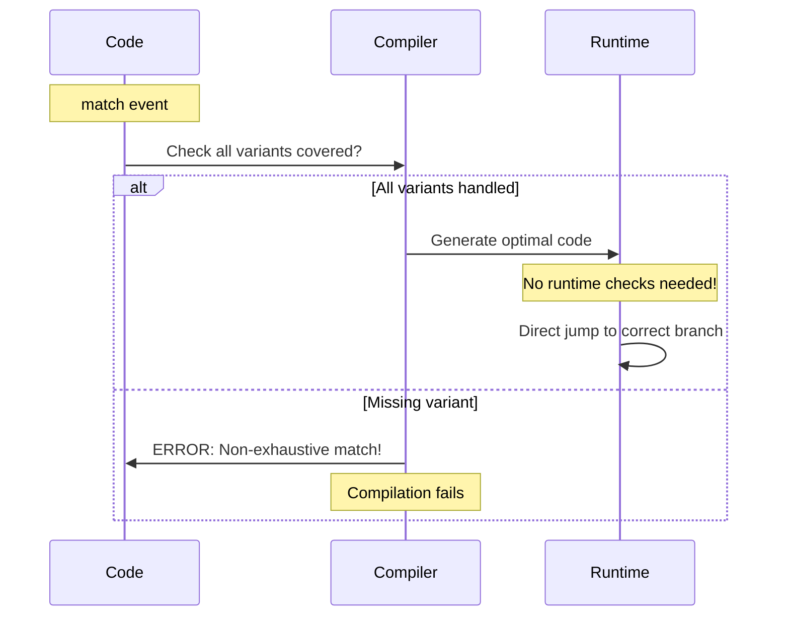
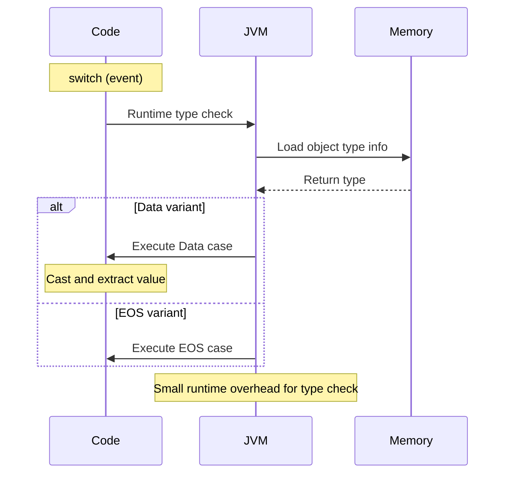
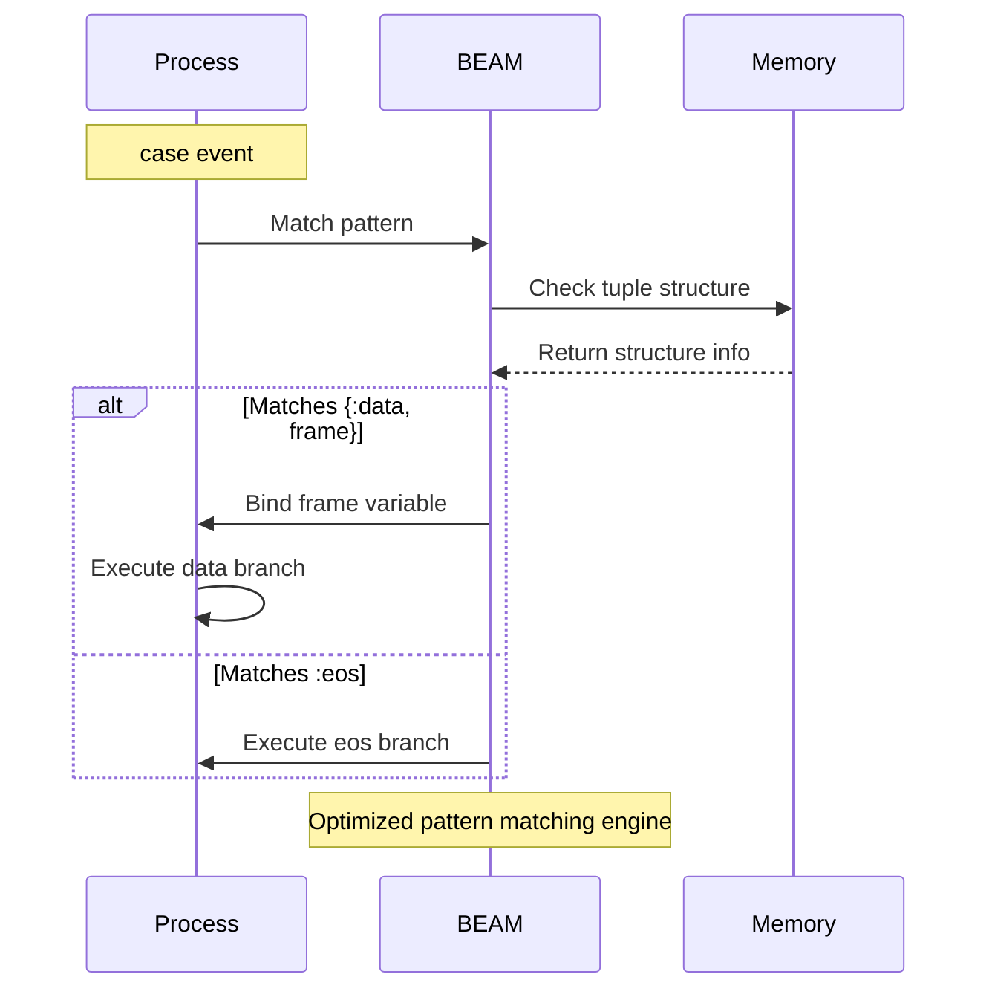
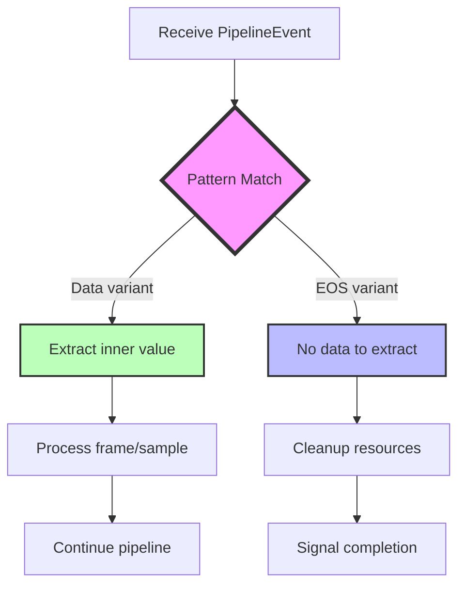

# Enums & Pattern Matching

A side-by-side comparison across languages

## Concept Overview

**Rust enums** (algebraic data types) can hold different types of data in each variant. Combined with pattern matching, they provide type-safe, exhaustive handling of all cases.

---

## Side-by-Side Comparison

### Rust

```rust
// Enum with data variants
pub enum PipelineEvent<T> {
    Data(T),
    EOS,  // End of Stream
}

// Pattern matching (exhaustive)
fn handle_event(event: PipelineEvent<Frame>) {
    match event {
        PipelineEvent::Data(frame) => {
            println!("Got frame at {:?}", frame.pts);
            process_frame(frame);
        }
        PipelineEvent::EOS => {
            println!("Stream ended");
            cleanup();
        }
    }  // Compiler ensures all variants handled!
}
```

### Java (17+ with sealed classes)

```java
// Sealed interface with records
public sealed interface PipelineEvent<T> {
    record Data<T>(T value) implements PipelineEvent<T> {}
    record EOS<T>() implements PipelineEvent<T> {}
}

// Pattern matching (Java 17+)
public void handleEvent(PipelineEvent<Frame> event) {
    switch (event) {
        case PipelineEvent.Data<Frame> data -> {
            System.out.println("Got frame at " + data.value().pts);
            processFrame(data.value());
        }
        case PipelineEvent.EOS<Frame> eos -> {
            System.out.println("Stream ended");
            cleanup();
        }
    }
}

// Traditional approach (older Java)
public abstract class PipelineEvent<T> {
    public static class Data<T> extends PipelineEvent<T> {
        public final T value;
        public Data(T value) { this.value = value; }
    }

    public static class EOS<T> extends PipelineEvent<T> {}
}

public void handleEventOld(PipelineEvent<Frame> event) {
    if (event instanceof PipelineEvent.Data) {
        Frame frame = ((PipelineEvent.Data<Frame>) event).value;
        System.out.println("Got frame");
        processFrame(frame);
    } else if (event instanceof PipelineEvent.EOS) {
        System.out.println("Stream ended");
        cleanup();
    }
}
```

### Python

```python
from enum import Enum
from dataclasses import dataclass
from typing import Generic, TypeVar, Union

T = TypeVar('T')

# Using tagged union (Python 3.10+)
@dataclass
class Data(Generic[T]):
    value: T

@dataclass
class EOS:
    pass

PipelineEvent = Union[Data[T], EOS]

# Pattern matching (Python 3.10+)
def handle_event(event: PipelineEvent[Frame]):
    match event:
        case Data(frame):
            print(f"Got frame at {frame.pts}")
            process_frame(frame)
        case EOS():
            print("Stream ended")
            cleanup()

# Traditional approach (older Python)
def handle_event_old(event):
    if isinstance(event, Data):
        print(f"Got frame at {event.value.pts}")
        process_frame(event.value)
    elif isinstance(event, EOS):
        print("Stream ended")
        cleanup()
```

### TypeScript

```typescript
// Discriminated union
type PipelineEvent<T> =
    | { type: 'Data'; value: T }
    | { type: 'EOS' };

// Pattern matching via switch
function handleEvent(event: PipelineEvent<Frame>): void {
    switch (event.type) {
        case 'Data':
            console.log(`Got frame at ${event.value.pts}`);
            processFrame(event.value);
            break;
        case 'EOS':
            console.log('Stream ended');
            cleanup();
            break;
        // TypeScript enforces all cases if strictNullChecks enabled
    }
}

// Alternative: type guards
function handleEventAlt(event: PipelineEvent<Frame>): void {
    if (event.type === 'Data') {
        console.log(`Got frame at ${event.value.pts}`);
        processFrame(event.value);
    } else {  // TypeScript knows it's EOS
        console.log('Stream ended');
        cleanup();
    }
}
```

### Elixir

```elixir
# Tagged tuples (idiomatic Elixir)
defmodule PipelineEvent do
  @type t :: {:data, any()} | :eos

  def handle_event(event) do
    case event do
      {:data, frame} ->
        IO.puts("Got frame at #{frame.pts}")
        process_frame(frame)

      :eos ->
        IO.puts("Stream ended")
        cleanup()
    end
  end

  # Alternative: function clauses
  def handle_event_clauses({:data, frame}) do
    IO.puts("Got frame at #{frame.pts}")
    process_frame(frame)
  end

  def handle_event_clauses(:eos) do
    IO.puts("Stream ended")
    cleanup()
  end
end
```

---

## Runtime Behavior: Pattern Matching

### Rust - Compile-time Dispatch



### Java - Runtime Type Check



### Elixir - Pattern Matching at Runtime



---

## Real Example from Smelter

From `smelter-core/src/types.rs:6-9`:

```rust
pub enum PipelineEvent<T> {
    Data(T),
    EOS,
}
```

### Usage in Queue Processing

```rust
// From queue processing logic
fn process_queue_item(item: PipelineEvent<Frame>) {
    match item {
        PipelineEvent::Data(frame) => {
            // Extract frame and process it
            render_frame(frame);
        }
        PipelineEvent::EOS => {
            // Signal end of stream to downstream
            notify_stream_end();
        }
    }
}
```

### More Complex Example: AudioSamples

From `smelter-core/src/types.rs:24-27`:

```rust
pub enum AudioSamples {
    Mono(Vec<f64>),
    Stereo(Vec<(f64, f64)>),
}

impl AudioSamples {
    pub fn sample_count(&self) -> usize {
        match self {
            AudioSamples::Mono(samples) => samples.len(),
            AudioSamples::Stereo(items) => items.len(),
        }
    }
}
```

---

## Processing Flow with Pattern Matching



---

## Comparison Table

| Feature | Rust | Java | Python | TypeScript | Elixir |
|---------|------|------|--------|------------|---------|
| **Exhaustiveness** | Compile-time enforced | Partial (sealed classes) | No (runtime only) | Type-level only | Runtime warnings |
| **Data in variants** | ✅ Native | ✅ Via records/classes | ✅ Via dataclasses | ✅ Via properties | ✅ Via tuples |
| **Performance** | Zero-cost | Small overhead | Moderate overhead | Small overhead | Optimized VM |
| **Type safety** | Complete | Complete | Partial | Complete at compile | Dynamic |
| **Pattern syntax** | `match` | `switch` (17+) | `match` (3.10+) | `switch` + guards | `case` / function clauses |

---

## Advanced Pattern Matching in Rust

### Guards

```rust
match event {
    PipelineEvent::Data(frame) if frame.pts > threshold => {
        println!("Late frame!");
    }
    PipelineEvent::Data(frame) => {
        println!("On-time frame");
    }
    PipelineEvent::EOS => {
        println!("Stream ended");
    }
}
```

### Destructuring

```rust
match audio_samples {
    AudioSamples::Mono(samples) => {
        println!("Mono: {} samples", samples.len());
    }
    AudioSamples::Stereo(pairs) => {
        println!("Stereo: {} pairs", pairs.len());
    }
}
```

### If-let for Single Pattern

```rust
// Instead of full match, use if-let for one case
if let PipelineEvent::Data(frame) = event {
    process_frame(frame);
}
// Ignores EOS variant
```

---

## Result and Option: Special Enums

### Result<T, E>

```rust
// Rust's built-in Result enum
pub enum Result<T, E> {
    Ok(T),
    Err(E),
}

// Pattern matching on Result
match open_file("data.txt") {
    Ok(file) => println!("File opened"),
    Err(error) => eprintln!("Error: {}", error),
}

// The ? operator (syntactic sugar)
fn read_config() -> Result<Config, Error> {
    let file = open_file("config.json")?;  // Propagates error
    let config = parse_json(file)?;        // Propagates error
    Ok(config)
}
```

**Compare to Elixir:**

```elixir
# Elixir's {:ok, value} | {:error, reason}
case File.read("data.txt") do
  {:ok, content} -> IO.puts("File read")
  {:error, reason} -> IO.puts("Error: #{reason}")
end

# with construct (similar to ?)
with {:ok, file} <- File.read("config.json"),
     {:ok, config} <- parse_json(file) do
  {:ok, config}
end
```

---

## Common Patterns in Smelter

### Pattern 1: Event Processing

```rust
fn handle_input_event(event: PipelineEvent<Frame>) -> Option<Frame> {
    match event {
        PipelineEvent::Data(frame) => Some(frame),
        PipelineEvent::EOS => None,
    }
}
```

### Pattern 2: Codec Selection

```rust
pub enum VideoCodec {
    H264,
    VP8,
    VP9,
}

fn get_encoder(codec: VideoCodec) -> Box<dyn Encoder> {
    match codec {
        VideoCodec::H264 => Box::new(H264Encoder::new()),
        VideoCodec::VP8 => Box::new(VP8Encoder::new()),
        VideoCodec::VP9 => Box::new(VP9Encoder::new()),
    }
}
```

### Pattern 3: Error Handling

```rust
fn register_input(id: InputId) -> Result<(), RegisterInputError> {
    if already_registered(&id) {
        return Err(RegisterInputError::AlreadyRegistered(id));
    }

    initialize_input(id)
        .map_err(|e| RegisterInputError::InputError(id, e))?;

    Ok(())
}
```

---

## Why Rust's Approach is Powerful

1. **Exhaustiveness checking** - Compiler ensures you handle all cases
2. **No null pointer exceptions** - Use `Option<T>` instead
3. **Type-safe error handling** - Use `Result<T, E>` instead of exceptions
4. **Zero runtime cost** - Compiled to optimal code
5. **Refactoring safety** - Add new variant? Compiler shows all places to update

---

## Next Steps

1. Study enums in `smelter-core/src/types.rs`
2. Read Chapter 6 of [The Rust Book](https://doc.rust-lang.org/book/ch06-00-enums.html)
3. Explore error handling in `smelter-core/src/error.rs`
4. Next guide: [03-error-handling.md](./03-error-handling.md)
