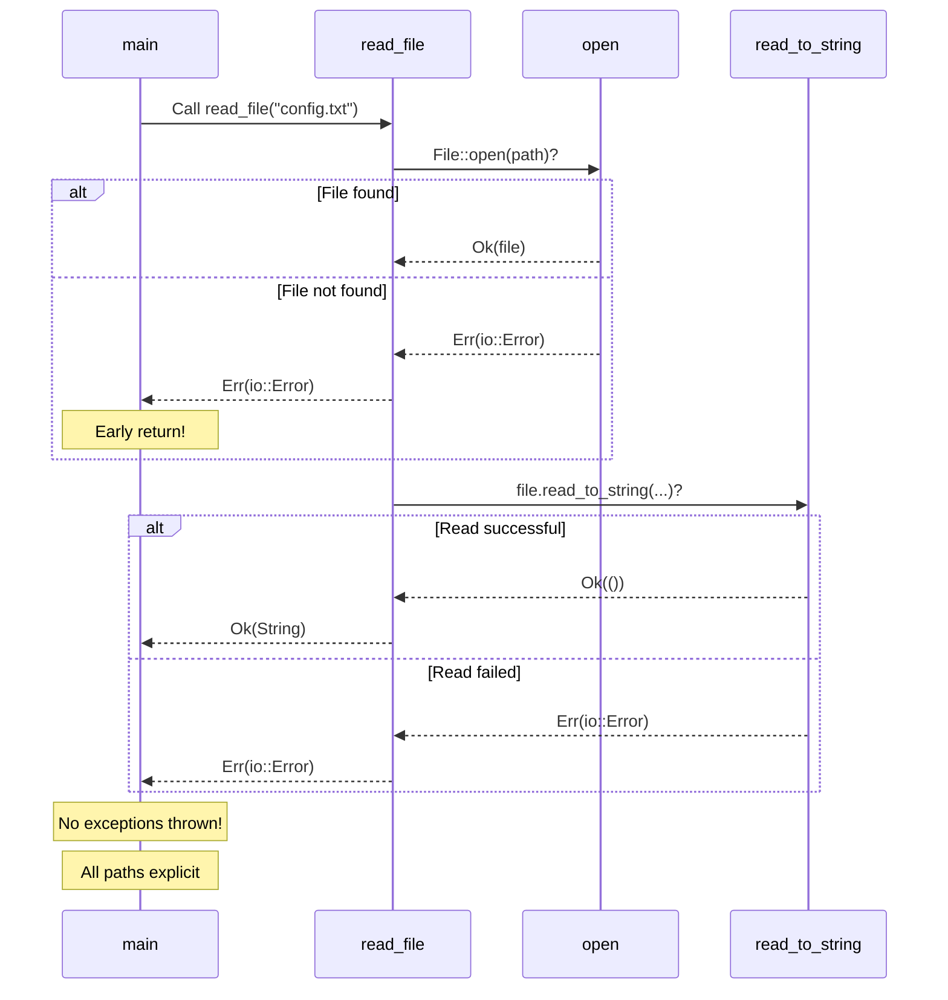
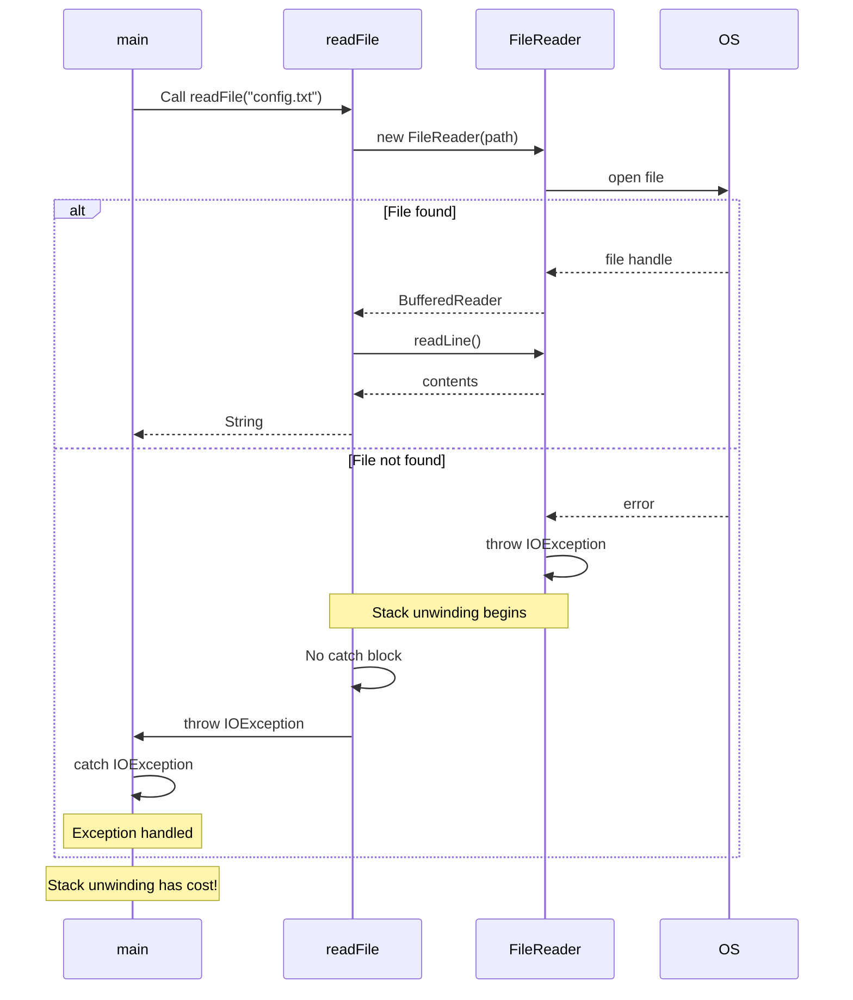
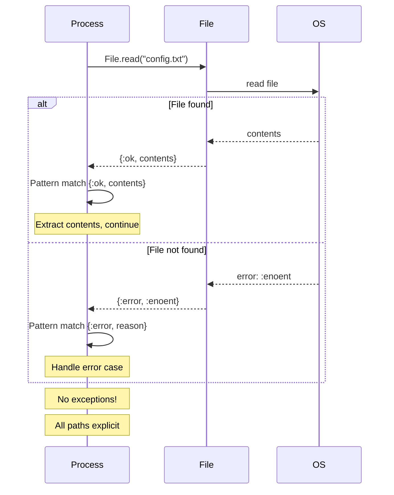
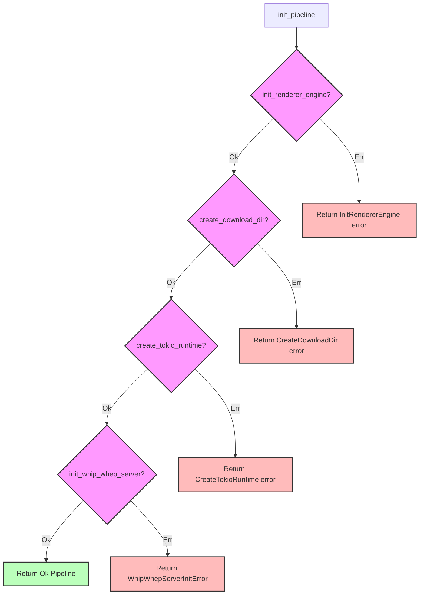

# Error Handling

A side-by-side comparison across languages

## Concept Overview

**Rust has no exceptions!** Errors are returned as values using the `Result<T, E>` enum. This makes error handling explicit, type-safe, and forces you to handle errors at compile time.

---

## Side-by-Side Comparison

### Rust

```rust
use std::fs::File;
use std::io::{self, Read};

// Result<T, E> for functions that can fail
fn read_file(path: &str) -> Result<String, io::Error> {
    let mut file = File::open(path)?;  // ? propagates errors
    let mut contents = String::new();
    file.read_to_string(&mut contents)?;
    Ok(contents)
}

// Using the result
fn main() {
    match read_file("config.txt") {
        Ok(contents) => println!("File: {}", contents),
        Err(error) => eprintln!("Error: {}", error),
    }
}

// Or use ? in main
fn main() -> Result<(), io::Error> {
    let contents = read_file("config.txt")?;
    println!("File: {}", contents);
    Ok(())
}
```

### Java

```java
import java.io.*;

// Checked exceptions
public String readFile(String path) throws IOException {
    StringBuilder contents = new StringBuilder();
    try (BufferedReader reader = new BufferedReader(new FileReader(path))) {
        String line;
        while ((line = reader.readLine()) != null) {
            contents.append(line);
        }
    }
    return contents.toString();
}

// Using the result
public static void main(String[] args) {
    try {
        String contents = readFile("config.txt");
        System.out.println("File: " + contents);
    } catch (IOException e) {
        System.err.println("Error: " + e.getMessage());
    }
}

// Or throw from main
public static void main(String[] args) throws IOException {
    String contents = readFile("config.txt");
    System.out.println("File: " + contents);
}
```

### Python

```python
def read_file(path: str) -> str:
    """Raises IOError on failure"""
    with open(path, 'r') as file:
        return file.read()

# Using the result
def main():
    try:
        contents = read_file("config.txt")
        print(f"File: {contents}")
    except IOError as e:
        print(f"Error: {e}", file=sys.stderr)

# Or let it bubble up
def main():
    contents = read_file("config.txt")  # May raise
    print(f"File: {contents}")

# Modern approach with Result-like pattern
from typing import Union, TypeVar
from dataclasses import dataclass

T = TypeVar('T')
E = TypeVar('E')

@dataclass
class Ok:
    value: T

@dataclass
class Err:
    error: E

Result = Union[Ok[T], Err[E]]

def read_file_result(path: str) -> Result[str, str]:
    try:
        with open(path, 'r') as file:
            return Ok(file.read())
    except IOError as e:
        return Err(str(e))
```

### TypeScript

```typescript
import * as fs from 'fs';

// Throwing errors
function readFile(path: string): string {
    try {
        return fs.readFileSync(path, 'utf-8');
    } catch (error) {
        throw new Error(`Failed to read file: ${error}`);
    }
}

// Using the result
function main() {
    try {
        const contents = readFile("config.txt");
        console.log(`File: ${contents}`);
    } catch (error) {
        console.error(`Error: ${error}`);
    }
}

// Result type approach (functional style)
type Result<T, E> =
    | { success: true; value: T }
    | { success: false; error: E };

function readFileResult(path: string): Result<string, string> {
    try {
        const contents = fs.readFileSync(path, 'utf-8');
        return { success: true, value: contents };
    } catch (error) {
        return { success: false, error: String(error) };
    }
}

// Using Result
function mainResult() {
    const result = readFileResult("config.txt");
    if (result.success) {
        console.log(`File: ${result.value}`);
    } else {
        console.error(`Error: ${result.error}`);
    }
}
```

### Elixir

```elixir
defmodule FileReader do
  @spec read_file(String.t()) :: {:ok, String.t()} | {:error, atom()}
  def read_file(path) do
    File.read(path)  # Returns {:ok, contents} or {:error, reason}
  end

  # Using the result with case
  def main do
    case read_file("config.txt") do
      {:ok, contents} ->
        IO.puts("File: #{contents}")

      {:error, reason} ->
        IO.puts(:stderr, "Error: #{reason}")
    end
  end

  # Using with construct (like Rust's ?)
  def process_files do
    with {:ok, config} <- read_file("config.txt"),
         {:ok, data} <- read_file("data.txt") do
      {:ok, {config, data}}
    else
      {:error, reason} -> {:error, reason}
    end
  end
end
```

---

## Runtime Behavior: Error Propagation

### Rust - Result Propagation with ?



### Java - Exception Stack Unwinding



### Elixir - Tagged Tuple Returns



---

## Real Example from Smelter

From `smelter-core/src/error.rs:11-27`:

```rust
use thiserror::Error;

#[derive(Debug, Error)]
pub enum InitPipelineError {
    #[error(transparent)]
    InitRendererEngine(#[from] InitRendererEngineError),

    #[error("Failed to create a download directory.")]
    CreateDownloadDir(#[source] std::io::Error),

    #[error("Failed to create tokio::Runtime.")]
    CreateTokioRuntime(#[source] std::io::Error),

    #[error("Failed to initialize WHIP WHEP server.")]
    WhipWhepServerInitError(#[source] std::io::Error),
}
```

### Using the Error Type

```rust
pub fn init_pipeline(opts: PipelineOptions) -> Result<Pipeline, InitPipelineError> {
    // ? automatically converts errors using #[from]
    let renderer = init_renderer_engine()?;

    // Manual error conversion with .map_err()
    let download_dir = create_download_dir()
        .map_err(InitPipelineError::CreateDownloadDir)?;

    let runtime = tokio::runtime::Runtime::new()
        .map_err(InitPipelineError::CreateTokioRuntime)?;

    Ok(Pipeline {
        renderer,
        download_dir,
        runtime,
    })
}
```

---

## Error Handling Patterns

### Pattern 1: The ? Operator

```rust
// Without ?
fn read_config() -> Result<Config, Error> {
    let file = match File::open("config.json") {
        Ok(f) => f,
        Err(e) => return Err(e.into()),
    };

    let contents = match read_to_string(file) {
        Ok(c) => c,
        Err(e) => return Err(e.into()),
    };

    let config = match parse_json(&contents) {
        Ok(cfg) => cfg,
        Err(e) => return Err(e.into()),
    };

    Ok(config)
}

// With ? (equivalent!)
fn read_config() -> Result<Config, Error> {
    let file = File::open("config.json")?;
    let contents = read_to_string(file)?;
    let config = parse_json(&contents)?;
    Ok(config)
}
```

### Pattern 2: Multiple Error Types

```rust
use thiserror::Error;

#[derive(Debug, Error)]
pub enum AppError {
    #[error("IO error: {0}")]
    Io(#[from] std::io::Error),

    #[error("Parse error: {0}")]
    Parse(#[from] serde_json::Error),

    #[error("Custom error: {0}")]
    Custom(String),
}

fn process() -> Result<(), AppError> {
    let file = File::open("data.json")?;  // io::Error -> AppError
    let data: Data = serde_json::from_reader(file)?;  // serde_json::Error -> AppError

    if data.is_valid() {
        Ok(())
    } else {
        Err(AppError::Custom("Invalid data".into()))
    }
}
```

### Pattern 3: Error Context

```rust
use anyhow::{Context, Result};

fn load_config() -> Result<Config> {
    let contents = fs::read_to_string("config.json")
        .context("Failed to read config file")?;

    let config: Config = serde_json::from_str(&contents)
        .context("Failed to parse config JSON")?;

    Ok(config)
}

// Error output:
// Failed to parse config JSON
// Caused by:
//     EOF while parsing a value at line 5 column 0
```

---

## Comparison Table

| Language | Error Model | Explicit | Type-Safe | Performance |
|----------|-------------|----------|-----------|-------------|
| **Rust** | Result<T, E> | ✅ Yes | ✅ Yes | ⚡ Zero-cost |
| **Java** | Checked exceptions | ⚠️ Partial | ✅ Yes | ❌ Stack unwinding |
| **Python** | Exceptions | ❌ No | ❌ No | ❌ Stack unwinding |
| **TypeScript** | Exceptions (or Result) | ❌ No | ⚠️ Optional | ❌ Stack unwinding |
| **Elixir** | {:ok, val} \| {:error, err} | ✅ Yes | ⚠️ Runtime | ⚡ Fast |

---

## Error Flow in Smelter Pipeline



---

## Advanced: Custom Error Types

### From Smelter's Error Handling

```rust
// Custom error info for HTTP responses
pub struct PipelineErrorInfo {
    pub error_code: &'static str,
    pub error_type: ErrorType,
}

pub enum ErrorType {
    UserError,
    ServerError,
    EntityNotFound,
}

// Converting errors to error info
impl From<&RegisterInputError> for PipelineErrorInfo {
    fn from(err: &RegisterInputError) -> Self {
        match err {
            RegisterInputError::AlreadyRegistered(_) => {
                PipelineErrorInfo::new(
                    "INPUT_STREAM_ALREADY_REGISTERED",
                    ErrorType::UserError
                )
            }
            RegisterInputError::InputError(_, _) => {
                PipelineErrorInfo::new(
                    "INPUT_STREAM_INPUT_ERROR",
                    ErrorType::ServerError
                )
            }
        }
    }
}
```

---

## Why Rust's Approach is Better

1. **Explicit**: Can't ignore errors (compiler enforces handling)
2. **Type-safe**: Know exactly what errors can occur
3. **Zero-cost**: No stack unwinding overhead
4. **Composable**: Easy to convert between error types
5. **Traceable**: Full error chain preserved
6. **No panics**: Predictable control flow

---

## Elixir Developers: You'll Feel at Home!

Rust's `Result<T, E>` is almost identical to Elixir's `{:ok, value} | {:error, reason}`:

```elixir
# Elixir
def read_file(path) do
  case File.read(path) do
    {:ok, contents} -> process(contents)
    {:error, reason} -> handle_error(reason)
  end
end

with {:ok, config} <- read_config(),
     {:ok, data} <- read_data() do
  {:ok, {config, data}}
end
```

```rust
// Rust
fn read_file(path: &str) -> Result<String, io::Error> {
    match File::open(path) {
        Ok(file) => Ok(process(file)),
        Err(error) => Err(handle_error(error)),
    }
}

fn process() -> Result<(Config, Data), Error> {
    let config = read_config()?;
    let data = read_data()?;
    Ok((config, data))
}
```

---

## Next Steps

1. Study error types in `smelter-core/src/error.rs`
2. Read Chapter 9 of [The Rust Book](https://doc.rust-lang.org/book/ch09-00-error-handling.html)
3. Try the `thiserror` and `anyhow` crates
4. Next guide: [04-concurrency.md](./04-concurrency.md)
