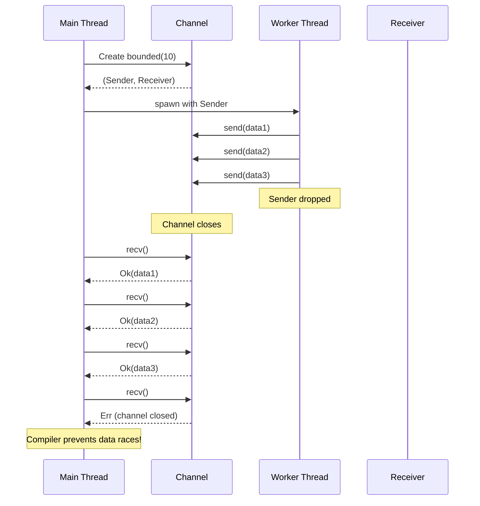
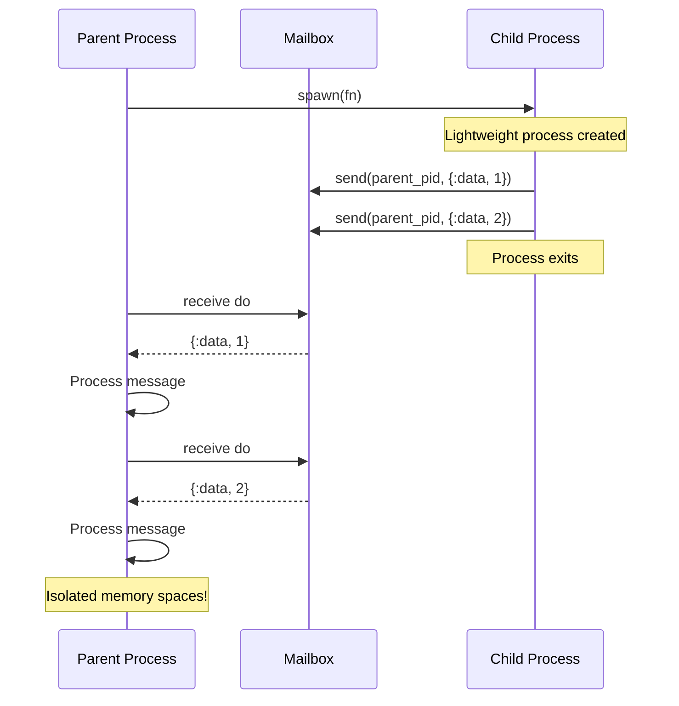
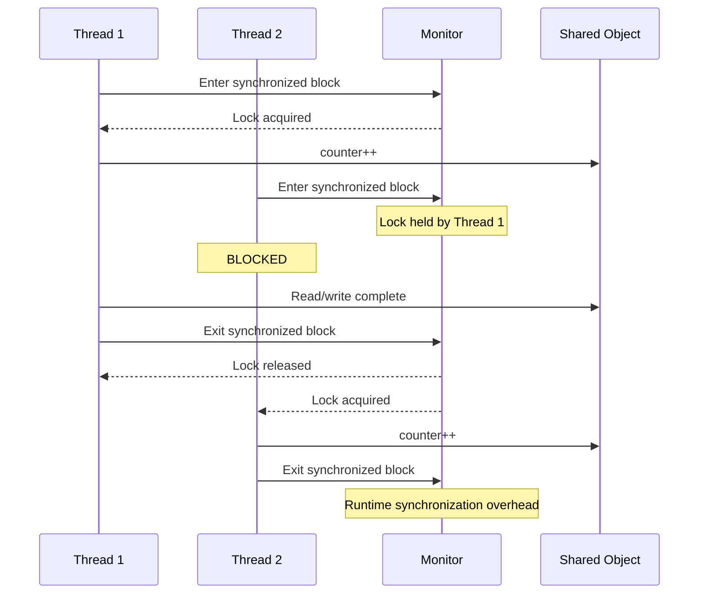
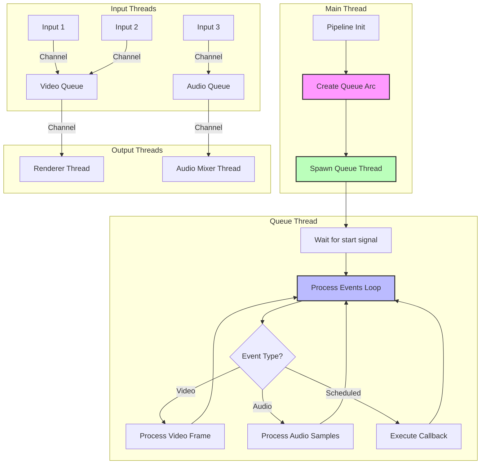
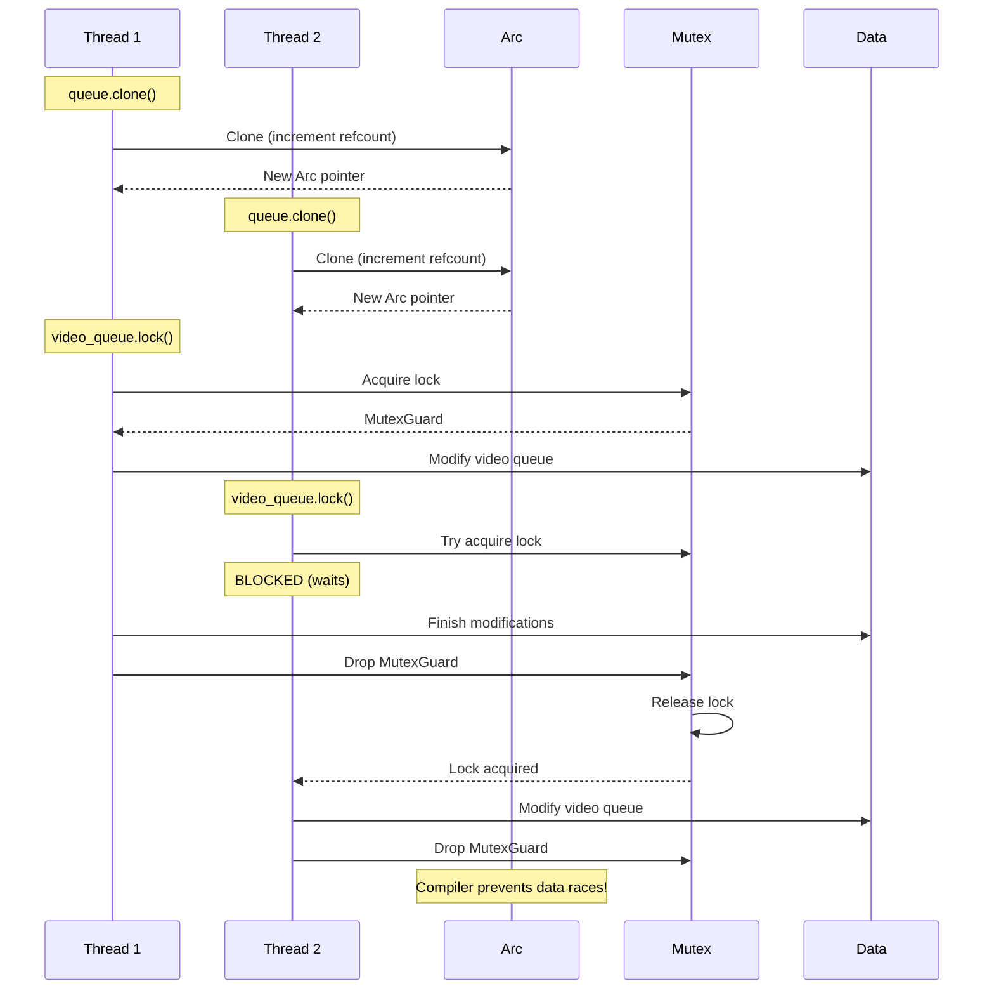

# Concurrency & Parallelism

A side-by-side comparison across languages

## Concept Overview

**Rust's concurrency model** uses threads and channels (CSP-style) with compile-time prevention of data races. Shared state requires explicit synchronization with `Arc<Mutex<T>>` or `Arc<RwLock<T>>`.

---

## Side-by-Side Comparison

### Rust

```rust
use std::thread;
use std::sync::{Arc, Mutex};
use crossbeam_channel::bounded;

// Pattern 1: Channels (message passing)
fn channel_example() {
    let (tx, rx) = bounded(10);

    thread::spawn(move || {
        for i in 0..5 {
            tx.send(i).unwrap();
        }
    });

    for received in rx {
        println!("Got: {}", received);
    }
}

// Pattern 2: Shared state with Arc + Mutex
fn shared_state_example() {
    let counter = Arc::new(Mutex::new(0));
    let mut handles = vec![];

    for _ in 0..10 {
        let counter_clone = counter.clone();
        let handle = thread::spawn(move || {
            let mut num = counter_clone.lock().unwrap();
            *num += 1;
        });
        handles.push(handle);
    }

    for handle in handles {
        handle.join().unwrap();
    }

    println!("Result: {}", *counter.lock().unwrap());
}
```

### Java

```java
import java.util.concurrent.*;

// Pattern 1: BlockingQueue (message passing)
public class ChannelExample {
    public void example() throws InterruptedException {
        BlockingQueue<Integer> queue = new ArrayBlockingQueue<>(10);

        new Thread(() -> {
            try {
                for (int i = 0; i < 5; i++) {
                    queue.put(i);
                }
            } catch (InterruptedException e) {
                Thread.currentThread().interrupt();
            }
        }).start();

        while (true) {
            Integer received = queue.take();
            System.out.println("Got: " + received);
        }
    }
}

// Pattern 2: Synchronized shared state
public class SharedStateExample {
    private int counter = 0;

    public void example() throws InterruptedException {
        Thread[] threads = new Thread[10];

        for (int i = 0; i < 10; i++) {
            threads[i] = new Thread(() -> {
                synchronized (this) {
                    counter++;
                }
            });
            threads[i].start();
        }

        for (Thread thread : threads) {
            thread.join();
        }

        System.out.println("Result: " + counter);
    }

    // Or use AtomicInteger
    private AtomicInteger atomicCounter = new AtomicInteger(0);

    public void atomicExample() {
        List<Thread> threads = new ArrayList<>();
        for (int i = 0; i < 10; i++) {
            Thread t = new Thread(() -> atomicCounter.incrementAndGet());
            t.start();
            threads.add(t);
        }
        threads.forEach(t -> t.join());
    }
}
```

### Python

```python
import threading
import queue

# Pattern 1: Queue (message passing)
def channel_example():
    q = queue.Queue(maxsize=10)

    def sender():
        for i in range(5):
            q.put(i)

    thread = threading.Thread(target=sender)
    thread.start()

    while not q.empty():
        received = q.get()
        print(f"Got: {received}")

    thread.join()

# Pattern 2: Lock for shared state
def shared_state_example():
    counter = 0
    lock = threading.Lock()

    def increment():
        nonlocal counter
        with lock:
            counter += 1

    threads = []
    for _ in range(10):
        t = threading.Thread(target=increment)
        t.start()
        threads.append(t)

    for t in threads:
        t.join()

    print(f"Result: {counter}")

# Note: Python has GIL (Global Interpreter Lock)
# True parallelism requires multiprocessing
```

### TypeScript/Node.js

```typescript
// Node.js is single-threaded (event loop model)
// For concurrency, use async/await

// Pattern 1: Async/await (not true parallelism)
async function channelExample() {
    const results: number[] = [];

    const sender = async () => {
        for (let i = 0; i < 5; i++) {
            results.push(i);
            await new Promise(resolve => setTimeout(resolve, 10));
        }
    };

    await sender();

    for (const value of results) {
        console.log(`Got: ${value}`);
    }
}

// Pattern 2: Worker threads (true parallelism)
import { Worker } from 'worker_threads';

function workerExample() {
    const worker = new Worker(`
        const { parentPort } = require('worker_threads');
        let counter = 0;
        parentPort.on('message', (msg) => {
            if (msg === 'increment') {
                counter++;
                parentPort.postMessage(counter);
            }
        });
    `, { eval: true });

    worker.postMessage('increment');
    worker.on('message', (count) => {
        console.log(`Result: ${count}`);
    });
}

// Most common: async/await for I/O concurrency
async function asyncExample() {
    const promises = Array.from({ length: 10 }, (_, i) =>
        fetch(`https://api.example.com/data/${i}`)
    );

    const results = await Promise.all(promises);
    console.log('All requests completed');
}
```

### Elixir

```elixir
# Pattern 1: Processes and message passing (core paradigm!)
defmodule ChannelExample do
  def example do
    parent = self()

    # Spawn a process
    spawn(fn ->
      for i <- 0..4 do
        send(parent, {:data, i})
      end
    end)

    # Receive messages
    for _ <- 0..4 do
      receive do
        {:data, value} ->
          IO.puts("Got: #{value}")
      end
    end
  end
end

# Pattern 2: Agent for shared state
defmodule SharedStateExample do
  def example do
    # Start an Agent (process managing state)
    {:ok, counter} = Agent.start_link(fn -> 0 end)

    # Spawn 10 processes to increment
    tasks = for _ <- 1..10 do
      Task.async(fn ->
        Agent.update(counter, fn count -> count + 1 end)
      end)
    end

    # Wait for all tasks
    Task.await_many(tasks)

    result = Agent.get(counter, fn count -> count end)
    IO.puts("Result: #{result}")
  end
end

# Pattern 3: GenServer for stateful process
defmodule Counter do
  use GenServer

  def start_link(initial_value) do
    GenServer.start_link(__MODULE__, initial_value)
  end

  def increment(pid) do
    GenServer.cast(pid, :increment)
  end

  def get(pid) do
    GenServer.call(pid, :get)
  end

  # Callbacks
  def init(initial_value), do: {:ok, initial_value}

  def handle_cast(:increment, count) do
    {:noreply, count + 1}
  end

  def handle_call(:get, _from, count) do
    {:reply, count, count}
  end
end
```

---

## Runtime Behavior: Thread Communication

### Rust - Channel Communication



### Elixir - Process Message Passing



### Java - Synchronized Access



---

## Real Example from Smelter

From `smelter-core/src/queue.rs:165-199`:

```rust
use crossbeam_channel::bounded;
use std::sync::{Arc, Mutex};

pub struct Queue {
    video_queue: Mutex<VideoQueue>,
    audio_queue: Mutex<AudioQueue>,
    // ...
}

impl Queue {
    pub(crate) fn new(opts: QueueOptions, ctx: &Arc<PipelineCtx>) -> Arc<Self> {
        // Create channels for communication
        let (queue_start_sender, queue_start_receiver) = bounded(0);
        let (scheduled_event_sender, scheduled_event_receiver) = bounded(0);

        let queue = Arc::new(Queue {
            video_queue: Mutex::new(VideoQueue::new(...)),
            audio_queue: Mutex::new(AudioQueue::new(...)),
            scheduled_event_sender,
            // ...
        });

        // Spawn thread for queue processing
        QueueThread::new(
            queue.clone(),                 // Clone Arc (cheap)
            queue_start_receiver,
            scheduled_event_receiver,
        ).spawn();

        queue
    }

    pub fn add_input(&self, input_id: &InputId, receiver: QueueDataReceiver, ...) {
        // Lock mutex to access queue
        if let Some(receiver) = receiver.video {
            self.video_queue.lock().unwrap().add_input(...);
        }
        if let Some(receiver) = receiver.audio {
            self.audio_queue.lock().unwrap().add_input(...);
        }
    }
}
```

---

## Concurrency Flow in Smelter



---

## Shared State: Arc + Mutex Pattern



---

## Comparison Table

| Feature | Rust | Java | Python | TypeScript | Elixir |
|---------|------|------|--------|------------|---------|
| **Threading Model** | OS threads | OS threads | OS threads (GIL) | Event loop + workers | Lightweight processes |
| **Data Race Prevention** | Compile-time | Runtime | None (GIL helps) | Runtime | Process isolation |
| **Message Passing** | Channels (crossbeam) | BlockingQueue | queue.Queue | N/A (worker messages) | Native (send/receive) |
| **Shared Memory** | Arc<Mutex<T>> | synchronized | threading.Lock | SharedArrayBuffer | Avoided (ETS tables) |
| **Performance** | ⚡ Zero-cost | Good | ❌ GIL limited | Good for I/O | ⚡ Excellent |
| **Safety** | ✅ Guaranteed | ⚠️ Runtime | ❌ Manual | ⚠️ Manual | ✅ Isolated |

---

## Common Patterns in Rust

### Pattern 1: Producer-Consumer

```rust
use crossbeam_channel::unbounded;

fn producer_consumer() {
    let (tx, rx) = unbounded();

    // Producer thread
    thread::spawn(move || {
        for i in 0..100 {
            tx.send(i).unwrap();
        }
    });

    // Consumer thread
    thread::spawn(move || {
        for received in rx {
            process(received);
        }
    });
}
```

### Pattern 2: Fan-out (multiple workers)

```rust
fn fan_out() {
    let (tx, rx) = bounded(100);
    let rx = Arc::new(Mutex::new(rx));

    // Spawn 4 worker threads
    for _ in 0..4 {
        let rx_clone = rx.clone();
        thread::spawn(move || {
            loop {
                let item = rx_clone.lock().unwrap().recv();
                match item {
                    Ok(data) => process(data),
                    Err(_) => break,  // Channel closed
                }
            }
        });
    }

    // Send work
    for i in 0..1000 {
        tx.send(i).unwrap();
    }
}
```

### Pattern 3: Shared State with Multiple Readers

```rust
use std::sync::RwLock;

fn multiple_readers() {
    let data = Arc::new(RwLock::new(vec![1, 2, 3]));

    // Multiple readers (no blocking)
    for _ in 0..5 {
        let data_clone = data.clone();
        thread::spawn(move || {
            let read_guard = data_clone.read().unwrap();
            println!("Data: {:?}", *read_guard);
        });
    }

    // Single writer (exclusive access)
    let data_clone = data.clone();
    thread::spawn(move || {
        let mut write_guard = data_clone.write().unwrap();
        write_guard.push(4);
    });
}
```

---

## Async/Await in Rust

Rust also has async/await for cooperative concurrency:

```rust
use tokio;  // Popular async runtime

#[tokio::main]
async fn main() {
    let task1 = tokio::spawn(async {
        // Async work
        fetch_data().await
    });

    let task2 = tokio::spawn(async {
        // Async work
        process_data().await
    });

    let (result1, result2) = tokio::join!(task1, task2);
}
```

### Async in Smelter

Smelter uses async for WebRTC connections:

```rust
// From smelter-core/src/pipeline/webrtc/
async fn handle_whip_request(req: Request) -> Result<Response, Error> {
    let offer = parse_sdp(&req).await?;
    let peer = create_peer_connection().await?;
    let answer = peer.create_answer(offer).await?;
    Ok(Response::new(answer))
}
```

---

## Elixir Developers: Different But Powerful!

**Elixir**: Message passing between isolated processes (share-nothing)
**Rust**: Shared memory with compile-time safety guarantees

Both approaches are safe, just different philosophies:

```elixir
# Elixir: Process per connection
defmodule Connection do
  def start_link(id) do
    spawn(fn -> loop(%{id: id, data: []}) end)
  end

  defp loop(state) do
    receive do
      {:add, data} ->
        loop(%{state | data: [data | state.data]})
      {:get, from} ->
        send(from, {:data, state.data})
        loop(state)
    end
  end
end
```

```rust
// Rust: Shared state with locks
struct Connection {
    id: u32,
    data: Mutex<Vec<Data>>,
}

impl Connection {
    fn add(&self, item: Data) {
        self.data.lock().unwrap().push(item);
    }

    fn get(&self) -> Vec<Data> {
        self.data.lock().unwrap().clone()
    }
}
```

---

## Why Rust's Concurrency is Safe

1. **Ownership prevents data races** - Can't share mutable data without synchronization
2. **Send and Sync traits** - Compiler tracks what can cross thread boundaries
3. **No race conditions** - Arc and Mutex ensure safe sharing
4. **Explicit** - Must use Arc/Mutex, can't accidentally share
5. **Zero runtime cost** - Same performance as C++

---

## The Send and Sync Traits

```rust
// Send: Type can be transferred between threads
// Sync: Type can be shared between threads via &T

// Examples:
// Vec<T> is Send (can move between threads)
// Arc<T> is Send + Sync (can share between threads)
// Rc<T> is neither (single-threaded only)
// Mutex<T> makes T Sync

fn must_be_send<T: Send>(val: T) {
    thread::spawn(move || {
        // Can use val here
    });
}

fn must_be_sync<T: Sync>(val: &T) {
    thread::spawn(move || {
        // Can use val reference here
    });
}
```

---

## Next Steps

1. Study concurrency in `smelter-core/src/queue.rs`
2. Read Chapter 16 of [The Rust Book](https://doc.rust-lang.org/book/ch16-00-concurrency.html)
3. Explore the `crossbeam` crate
4. Try building a simple producer-consumer example
5. Next guide: [README.md](./README.md) (overview and learning path)
