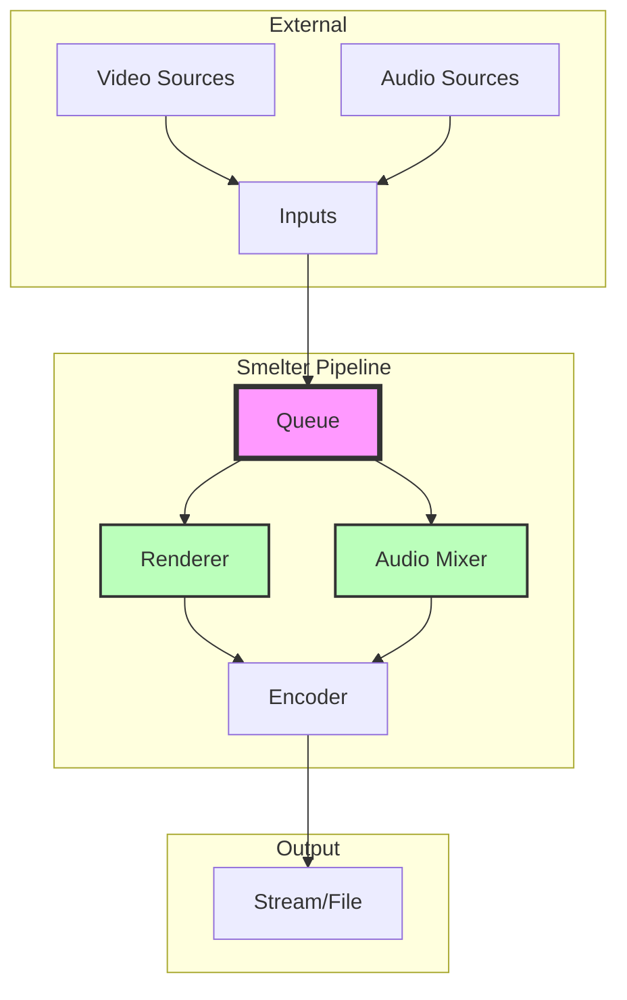

# Learning Rust Through Smelter

**A comprehensive guide for Java, Python, TypeScript, and Elixir developers**

---

## 🎯 Quick Start

1. **Read the overview**: [RUST_LEARNING_GUIDE.md](./RUST_LEARNING_GUIDE.md)
2. **Follow the detailed guides** (see below)
3. **Study the codebase** with your new knowledge
4. **Build something!**

---

## 📚 Detailed Guides

Each guide includes:
- ✅ Side-by-side code comparisons for all 5 languages
- ✅ Mermaid diagrams showing runtime behavior
- ✅ Real examples from the Smelter codebase
- ✅ Practical patterns and tips

### Core Concepts

| Guide | Topic | What You'll Learn | Best For |
|-------|-------|-------------------|----------|
| [01-ownership-comparison.md](./01-ownership-comparison.md) | **Ownership & Memory** | How Rust manages memory without GC | Java/Python/TS devs unfamiliar with manual memory mgmt |
| [02-enums-pattern-matching.md](./02-enums-pattern-matching.md) | **Enums & Pattern Matching** | Algebraic data types and exhaustive matching | Everyone, especially Elixir devs! |
| [03-error-handling.md](./03-error-handling.md) | **Error Handling** | Result<T, E> instead of exceptions | Elixir devs will feel at home |
| [04-concurrency.md](./04-concurrency.md) | **Concurrency** | Threads, channels, Arc, Mutex | Understanding Smelter's architecture |

### General Overview

| Guide | Description |
|-------|-------------|
| [RUST_LEARNING_GUIDE.md](./RUST_LEARNING_GUIDE.md) | Complete overview with concept maps, learning path, and resources |

---

## 🗺️ Learning Path

### Week 1-2: Foundations

**Start with the basics:**

1. Read [01-ownership-comparison.md](./01-ownership-comparison.md)
   - Understand move vs. borrow
   - Try examples in the Rust Playground
   - Study `smelter-core/src/types.rs`

2. Read [02-enums-pattern-matching.md](./02-enums-pattern-matching.md)
   - See how powerful enums are
   - Compare to your language's approach
   - Study `smelter-core/src/types.rs` (MediaKind, AudioSamples)

3. Read [03-error-handling.md](./03-error-handling.md)
   - Learn the `Result<T, E>` pattern
   - Practice with `?` operator
   - Study `smelter-core/src/error.rs`

**Practice:**
- Write simple functions with ownership rules
- Create enums and match on them
- Handle errors with Result

### Week 3-4: Application Logic

**Dive into real code:**

4. Read [04-concurrency.md](./04-concurrency.md)
   - Understand channels and Arc<Mutex<T>>
   - See how Smelter coordinates threads
   - Study `smelter-core/src/queue.rs`

5. Study the Queue implementation
   - File: `smelter-core/src/queue.rs` (287 lines)
   - Combines: ownership, enums, errors, and concurrency
   - Real-world application logic

**Practice:**
- Build a simple producer-consumer
- Use channels to communicate between threads
- Protect shared state with Arc<Mutex<>>

### Week 5-6: Advanced Topics

**Go deeper:**

6. Traits and generics
   - Read Chapter 10 of [The Rust Book](https://doc.rust-lang.org/book/ch10-00-generics.html)
   - Study trait implementations in `smelter-core/src/error.rs`

7. Async/await (optional)
   - Relevant for understanding WebRTC code
   - Files: `smelter-core/src/pipeline/webrtc/`

8. FFI (Foreign Function Interface)
   - How Rust calls C libraries
   - File: `src/main.rs` (FFmpeg integration)

**Practice:**
- Implement custom traits
- Create generic functions
- Try async programming with tokio

### Week 7+: Build Something!

**Apply your knowledge:**

**Beginner Tasks:**
- Add a new codec to `smelter-core/src/codecs/`
- Add a new error variant to `smelter-core/src/error.rs`
- Write tests for existing functionality

**Intermediate Tasks:**
- Add metrics/logging for frame processing
- Implement a simple input source
- Optimize a hot code path

**Advanced Tasks:**
- Contribute a feature to Smelter
- Fix a bug from the issue tracker
- Improve documentation

---

## 🔍 Quick Reference by Language Background

### Coming from Elixir?

**You'll love these similarities:**
- Pattern matching (even better!)
- `Result<T, E>` ≈ `{:ok, val} | {:error, reason}`
- Functional programming style
- Immutability by default

**Key differences:**
- Shared memory instead of processes
- Compile-time vs. runtime checks
- Static typing
- Manual (but safe) memory management

**Start here:** [02-enums-pattern-matching.md](./02-enums-pattern-matching.md) and [03-error-handling.md](./03-error-handling.md)

### Coming from Java?

**You'll love these improvements:**
- No null pointer exceptions (use `Option<T>`)
- No unchecked exceptions (use `Result<T, E>`)
- Better enums (can hold data!)
- No inheritance (composition instead)

**Key differences:**
- No garbage collection
- Ownership system
- No reflection
- Compile-time over runtime

**Start here:** [01-ownership-comparison.md](./01-ownership-comparison.md) and [03-error-handling.md](./03-error-handling.md)

### Coming from Python?

**You'll love these features:**
- Strong type safety
- Compile-time error detection
- Blazing fast performance
- Pattern matching (like Python 3.10+)

**Key differences:**
- Everything is typed
- Explicit memory management
- No duck typing
- Must handle all errors

**Start here:** [01-ownership-comparison.md](./01-ownership-comparison.md) and [02-enums-pattern-matching.md](./02-enums-pattern-matching.md)

### Coming from TypeScript?

**You'll love these improvements:**
- Types exist at runtime
- No `null` or `undefined` (use `Option<T>`)
- True enums with data
- Systems-level control

**Key differences:**
- Memory management
- Different runtime model
- No dynamic typing fallback
- More explicit code

**Start here:** [01-ownership-comparison.md](./01-ownership-comparison.md) and [02-enums-pattern-matching.md](./02-enums-pattern-matching.md)

---

## 🏗️ Understanding Smelter's Architecture

### High-Level Overview



### Key Components & Rust Concepts

| Component | File | Rust Concepts Used |
|-----------|------|-------------------|
| **Pipeline** | `smelter-core/src/pipeline.rs` | Ownership, Arc, Result |
| **Queue** | `smelter-core/src/queue.rs` | Channels, Mutex, Threads |
| **Error Types** | `smelter-core/src/error.rs` | Enums, thiserror, From trait |
| **Types** | `smelter-core/src/types.rs` | Enums, Pattern matching |
| **Codecs** | `smelter-core/src/codecs/` | Traits, Generics |
| **WebRTC** | `smelter-core/src/pipeline/webrtc/` | Async/await, Result |

---

## 🛠️ Development Setup

### Install Rust

```bash
curl --proto '=https' --tlsv1.2 -sSf https://sh.rustup.rs | sh
```

### Clone and Build Smelter

```bash
git clone https://github.com/software-mansion/smelter.git
cd smelter
cargo build
```

### Essential Commands

```bash
# Check code without building (fast!)
cargo check

# Build in debug mode
cargo build

# Build in release mode (optimized)
cargo build --release

# Run tests
cargo test

# Run tests for specific crate
cargo test -p smelter-core

# Generate and open documentation
cargo doc --open

# Format code
cargo fmt

# Run linter
cargo clippy

# Run specific binary
cargo run --bin smelter
```

### IDE Setup

**VS Code (recommended):**
```bash
# Install rust-analyzer extension
code --install-extension rust-lang.rust-analyzer
```

**IntelliJ IDEA:**
- Install Rust plugin
- Import as Cargo project

---

## 📖 Additional Resources

### Official Documentation

- [The Rust Book](https://doc.rust-lang.org/book/) - **Start here!**
- [Rust by Example](https://doc.rust-lang.org/rust-by-example/) - Learn by doing
- [Rustlings](https://github.com/rust-lang/rustlings) - Interactive exercises
- [Rust Standard Library](https://doc.rust-lang.org/std/) - API reference

### Language-Specific Resources

- **From Java:** [Rust for Java Developers](https://github.com/Dhghomon/rust_for_java_developers)
- **From Python:** [Python to Rust](https://github.com/rochacbruno/py2rs)
- **From TypeScript:** [Rust for TypeScript Developers](https://github.com/pretzelhammer/rust-blog)

### Smelter Resources

- [Smelter Documentation](https://smelter.dev/docs)
- [DEVELOPMENT.md](../../DEVELOPMENT.md) - Build instructions
- [Discord Community](https://discord.gg/Cxj3rzTTag)

### Community

- [r/rust](https://reddit.com/r/rust) - Reddit community
- [Rust Users Forum](https://users.rust-lang.org/) - Q&A
- [Rust Discord](https://discord.gg/rust-lang) - Chat

---

## 🎓 Practice Projects

### Beginner Level

1. **CLI Tool**
   - Build a simple command-line tool
   - Use `clap` for argument parsing
   - Handle files with Result<T, E>

2. **Data Processor**
   - Read CSV/JSON files
   - Transform data
   - Write output

3. **HTTP Client**
   - Use `reqwest` crate
   - Make API calls
   - Parse JSON responses

### Intermediate Level

1. **Concurrent Download Manager**
   - Multiple threads
   - Channel communication
   - Progress tracking

2. **Simple HTTP Server**
   - Use `axum` or `actix-web`
   - Handle routes
   - JSON API

3. **Video Frame Extractor**
   - Use FFmpeg bindings
   - Extract frames from video
   - Save as images

### Advanced Level

1. **Mini Video Compositor**
   - Read multiple video inputs
   - Overlay frames
   - Encode output

2. **Contribute to Smelter**
   - Pick an issue from GitHub
   - Fix a bug or add a feature
   - Submit a pull request

---

## 🐛 Common Pitfalls & Solutions

### Pitfall 1: Fighting the Borrow Checker

```rust
// ❌ This won't compile
let s1 = String::from("hello");
let s2 = s1;
println!("{}", s1);  // ERROR: s1 moved

// ✅ Solution: Clone if you need both
let s1 = String::from("hello");
let s2 = s1.clone();
println!("{} {}", s1, s2);  // OK

// ✅ Or borrow instead
let s1 = String::from("hello");
let s2 = &s1;
println!("{} {}", s1, s2);  // OK
```

### Pitfall 2: Unwrapping Instead of Error Handling

```rust
// ❌ Panics on error
let file = File::open("config.json").unwrap();

// ✅ Handle errors properly
let file = File::open("config.json")?;

// ✅ Or with match
let file = match File::open("config.json") {
    Ok(f) => f,
    Err(e) => return Err(e.into()),
};
```

### Pitfall 3: Mutex Deadlocks

```rust
// ❌ Can deadlock
let data = Arc::new(Mutex::new(0));
let guard1 = data.lock().unwrap();
let guard2 = data.lock().unwrap();  // DEADLOCK!

// ✅ Drop guard before locking again
let data = Arc::new(Mutex::new(0));
{
    let mut guard = data.lock().unwrap();
    *guard += 1;
}  // Guard dropped here
let guard = data.lock().unwrap();  // OK
```

---

## 💡 Tips for Success

1. **Read compiler errors carefully** - Rust's error messages are excellent teachers
2. **Use `cargo check` often** - Fast feedback loop
3. **Start small** - Don't try to understand everything at once
4. **Compare to your known language** - Use the analogies in these guides
5. **Practice daily** - Even 30 minutes helps
6. **Join the community** - Ask questions, share knowledge
7. **Read other people's code** - Study Smelter and other projects
8. **Use rust-analyzer** - Great IDE support
9. **Don't fear the borrow checker** - It's helping you write safe code
10. **Have fun!** - Rust is powerful and enjoyable

---

## 🚀 Next Steps

1. **Choose your starting guide** based on your background (see above)
2. **Work through the learning path** (Weeks 1-7+)
3. **Study Smelter's code** with your new knowledge
4. **Build a practice project** to reinforce concepts
5. **Contribute to Smelter** when you feel ready!

---

## 🤝 Contributing

Found an error in these guides? Want to add more examples?

1. File an issue or PR on the Smelter repository
2. Join the Discord and share feedback
3. Help other learners in the community

---

## 📄 License

These guides are part of the Smelter project and follow the same license.

---

**Happy learning! 🦀**

*Remember: Everyone struggles with the borrow checker at first. Stick with it - the "aha!" moment is coming!*
